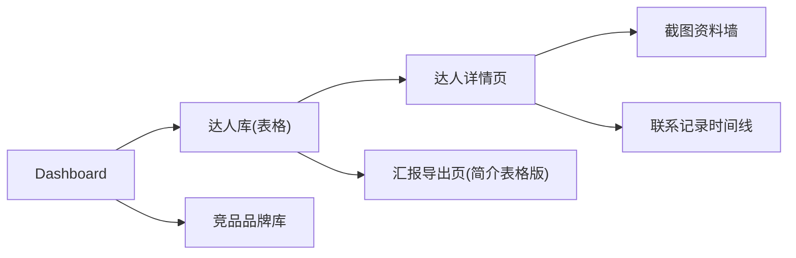
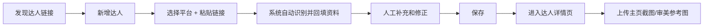
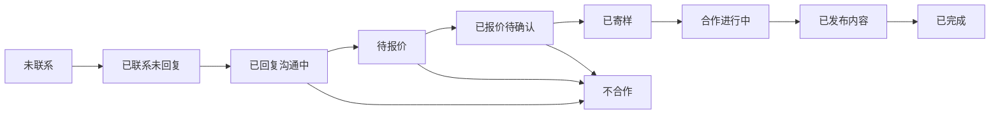
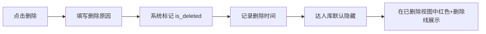
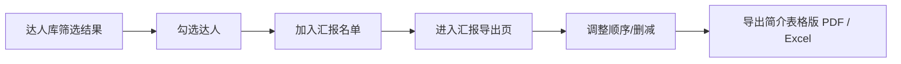

# KOL 网页线框与使用流程草案

这份文档是在规格稿基础上，把页面布局、按钮位置、操作流程进一步画清楚，方便直接进入开发。

参考规格稿：
[kol_web_solution_spec.md](/C:/Users/HUAWEI/Documents/Codex/2026-07-09/kol-kol-kol-tiktok-instagram-facebook/outputs/kol_web_solution_spec.md)

## 1. 整体产品结构



建议左侧固定导航：

- `Dashboard`
- `达人库`
- `竞品品牌库`
- `汇报导出`

右上角功能区建议保留：

- 全局搜索
- 新增达人
- 新增竞品品牌

## 2. 页面线框

## 2.1 Dashboard 线框

```text
+----------------------------------------------------------------------------------+
| Logo | Dashboard | 达人库 | 竞品品牌库 | 汇报导出                 搜索 | 新增达人 |
+----------------------------------------------------------------------------------+
| [总达人] [未联系] [已回复] [合作中] [已完成] [待汇报]                              |
|                                                                                  |
| [平台分布图]                                [合作状态分布图]                      |
|                                                                                  |
| [最近新增达人]                              [最近更新达人]                        |
+----------------------------------------------------------------------------------+
```

## 2.2 达人库线框

```text
+------------------------------------------------------------------------------------------------------+
| 达人库                                                                                 [+ 新增达人] |
+------------------------------------------------------------------------------------------------------+
| 搜索框 [____________________]   平台 [全部v] 国家 [全部v] 是否联系 [全部v] 状态 [全部v]            |
| 优先级 [全部v] 粉丝级别 [全部v] 是否汇报 [全部v] 已删除 [隐藏v]       [重置筛选] [导出筛选结果]   |
+------------------------------------------------------------------------------------------------------+
| [表格视图] [卡片视图]                                                          已选中 12 个达人      |
+------------------------------------------------------------------------------------------------------+
| □ | 平台 | 账号 | 达人名称 | 国家 | 粉丝数 | 粉丝级别 | 是否联系 | 合作状态 | 优先级 | 操作       |
| □ | IG   | @abc | xxx      | 美国 | 45K   | Micro   | 已联系   | 待报价   | A      | 查看/编辑  |
| □ | TT   | @yyy | xxx      | 英国 | 88K   | Mid     | 未联系   | 未联系   | A-     | 查看/编辑  |
| □ | IG   | ~~@zzz~~        | ~~旧达人~~ | ~~美国~~ | ~~12K~~ | ~~Nano~~ | ~~已联系~~ | ~~已删除~~ |
|   |      | (红色显示，整行删除线，保留删除时间与原因)                                                   |
+------------------------------------------------------------------------------------------------------+
| [加入汇报名单] [批量改状态] [批量改是否联系] [批量导出] [删除留痕]                                    |
+------------------------------------------------------------------------------------------------------+
```

### 达人库页的重点体验

1. 先筛选
2. 再浏览
3. 直接改状态
4. 勾选加入汇报名单
5. 删除时保留痕迹

## 2.3 达人详情页线框

```text
+------------------------------------------------------------------------------------------------------+
| 返回达人库                                                                                            |
+------------------------------------------------------------------------------------------------------+
| [达人头像/封面截图]   @handle                                                                       |
| 平台: Instagram      达人名称: Mengmeng Living                                                      |
| 国家: 匈牙利         粉丝: 42,000   粉丝级别: Micro                                                |
| 是否联系: 未联系     合作状态: 未联系   优先级: A-                                                 |
| [打开主页] [编辑资料] [加入汇报名单] [上传截图] [删除留痕]                                           |
+------------------------------------------------------------------------------------------------------+
| 基础资料 | 合作判断 | 联系记录 | 截图资料墙 | 数据表现                                             |
+------------------------------------------------------------------------------------------------------+
| 左栏：基础资料                                      | 右栏：截图资料墙                               |
| - 简介/关键词                                       | [截图1] [截图2] [截图3]                        |
| - 内容类型                                          | [截图4] [截图5] [上传按钮]                     |
| - 联系方式                                          |                                                |
| - 自动抓取状态: 已抓取                              |                                                |
|                                                     |                                                |
| 下方：联系记录时间线                                | 下方：备注                                     |
| - 7/09 新增达人                                     | - 这里写补充判断                               |
| - 7/09 系统自动回填账号/粉丝数                       |                                                |
| - 7/10 计划发送 DM                                  |                                                |
| - 7/12 收到回复                                     |                                                |
+------------------------------------------------------------------------------------------------------+
```

## 2.4 新增达人弹窗线框

```text
+--------------------------------------------------------------------------------------+
| 新增达人                                                                        [X]   |
+--------------------------------------------------------------------------------------+
| 平台 [Instagram v]                                                                  |
| 达人链接 [______________________________________________________________]           |
|                                                                                      |
| [自动识别并填写资料]                                                                  |
|                                                                                      |
| 达人账号 [@xxxx________________]   达人名称 [__________________________]             |
| 粉丝数   [______________________]   内容类型 [__________________________]             |
| 简介关键词 [__________________________________________________________]             |
| 国家地区 [______________________]   联系方式 [__________________________]             |
| 备注 [________________________________________________________________]             |
|                                                                                      |
|                                                [取消] [保存并进入详情页]              |
+--------------------------------------------------------------------------------------+
```

### 新增逻辑

- 先粘贴链接
- 点击自动识别
- 系统回填资料
- 你人工确认并补充
- 保存

## 2.5 竞品品牌库线框

```text
+------------------------------------------------------------------------------------------------------+
| 竞品品牌库                                                                               [+ 新增品牌] |
+------------------------------------------------------------------------------------------------------+
| 搜索 [________________] 国家 [全部v] 品类 [全部v] 价格带 [全部v] 母公司 [全部v]                    |
+------------------------------------------------------------------------------------------------------+
| [卡片视图] [表格视图]                                                                          共有32个 |
+------------------------------------------------------------------------------------------------------+
| [品牌logo] 品牌名 | 国家 | 品类 | 价格带 | 母公司 | [官网] [Amazon] [查看详情]                    |
| [品牌logo] 品牌名 | 国家 | 品类 | 价格带 | 母公司 | [官网] [Amazon] [查看详情]                    |
+------------------------------------------------------------------------------------------------------+
```

## 2.6 汇报导出页线框

```text
+------------------------------------------------------------------------------------------------------+
| 汇报导出                                                                                              |
+------------------------------------------------------------------------------------------------------+
| 汇报名单名称 [本周家居达人候选__________]      导出格式 [PDFv]     [生成导出]                        |
+------------------------------------------------------------------------------------------------------+
| 已选达人 14 个                                                                                        |
+------------------------------------------------------------------------------------------------------+
| 达人名 | 平台 | 国家 | 粉丝量 | 状态 | 推荐理由 | 链接                                               |
| A      | IG   | 美国 | 42K    | 未联系 | 审美匹配高 | profile...                                         |
| B      | TT   | 英国 | 88K    | 待报价 | 家居转化强 | profile...                                         |
| C      | FB   | 加拿大 | 18K | 已回复沟通中 | 适合寄样测试 | profile...                                   |
+------------------------------------------------------------------------------------------------------+
| [向上移动] [移除] [备注]                                                                              |
+------------------------------------------------------------------------------------------------------+
```

## 3. 关键使用流程

## 3.1 新增一个新达人



## 3.2 达人跟进流程



## 3.3 删除达人流程



## 3.4 给领导导出流程



## 4. Excel 到网页字段映射建议

### 可直接迁移到达人主表

| Excel 字段 | 网页字段 |
| --- | --- |
| 平台 | platform |
| 达人账号 | account_handle |
| 达人/账号名称 | display_name |
| Instagram URL | profile_url |
| 粉丝数 | follower_count |
| 粉丝级别 | follower_tier |
| 内容类型 | content_type |
| 地区/国家 | country |
| 主页简介/关键词 | bio_keywords |
| 匹配理由 | fit_reason |
| 推荐产品 | recommended_products |
| 合作方式建议 | collab_suggestion |
| 建议优先级 | priority |
| 初次联系渠道 | first_contact_channel |
| 公开邮箱/联系方式 | contact_info |
| 是否已联系 | is_contacted |
| 状态 | cooperation_status |
| 报价 | quote_amount |
| 寄样地址 | shipping_address |
| 计划联系日期 | planned_contact_date |
| 实际联系日期 | actual_contact_date |
| 发布时间 | publish_date |
| 内容链接 | content_url |
| 折扣码 | coupon_code |
| 点击 | clicks |
| 下单 | orders |
| 销售额 | revenue |
| 数据来源URL | source_url |
| 备注/待确认 | notes |

### 网页额外新增字段

- avatar_url
- auto_fill_status
- is_selected_for_report
- is_deleted
- deleted_at
- deletion_reason
- category
- price_band

## 5. 结论

这版线框已经对应你确认后的方案：

- 达人库主页用表格
- 新增达人时支持自动填资料
- 删除达人保留红色删除线痕迹
- 汇报导出用简介表格版
- 竞品品牌页增加品类和价格带

到这一步，已经可以直接进入网页开发。
